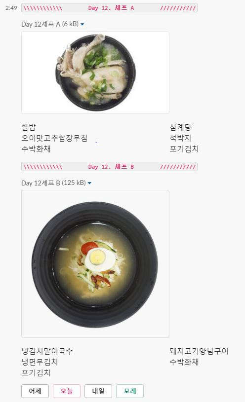

# Menu Alarm ChatBot (Slack)

식당 메뉴를 알려주는 Slack 용 챗봇입니다.


### 🔨 Stack
<a href="https://www.python.org/"></a>
<a href="https://flask.palletsprojects.com/en/1.1.x/"></a>
<a href="https://slack.com/intl/ko-kr/"></a>
<a href="https://ngrok.com/"></a>


### 🔧 Install

- [Install python 3.6.8](https://www.python.org/downloads/release/python-368/)

      > python --version
      Python 3.6.8

- Install package

      # package list include 'requirements.txt' file 
      > pip install -r requirements.txt

- Install [ngrok](https://dashboard.ngrok.com/get-started) server

  ``` ba
  $ unzip /ngrok.zip
  ```


### 🔸 Run

- Chatbot Server

  ```bash
  > python ./chatbot_project/control_chatbot.py
  ```

* ngrok Server

  ```bash
  $ {path_download_ngrok}/ngrok.exe http 5000
  ```


### 👓 UI


